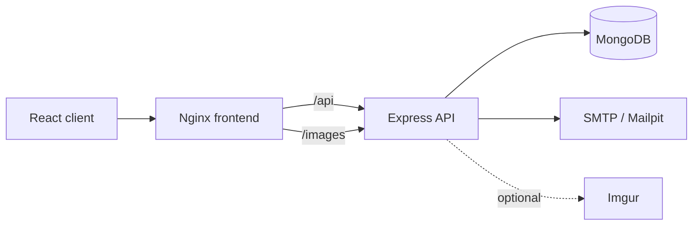

# Festivio

Festivio is an open-source event planning and operations platform for coordinating events, organizers, tasks and participants from one role-aware workspace.

The current production-readiness baseline focuses on secure session handling, explicit RBAC, reproducible Docker environments, health checks, CI security gates and a production frontend served by Nginx.

## What Festivio does

- **Event operations** — create and manage online or in-person events.
- **Participant coordination** — participants can discover, join and leave events.
- **Task execution** — organizer administrators assign work and organizers update the status of tasks they own.
- **Role-based access control** — authorization is enforced by the backend for administrators, organizer administrators, organizers and participants.
- **Secure sessions** — short-lived access tokens stay in memory while refresh tokens are rotated in `HttpOnly` cookies.
- **Local email testing** — Mailpit captures verification and password-reset emails during local development.

## Roles

| Role | Main permissions | Public registration |
| --- | --- | --- |
| `ROLE_ADMIN` | Platform-wide administration | No |
| `ROLE_ORGANIZER_ADMIN` | Create/manage owned events and their tasks | No |
| `ROLE_ORGANIZER` | View assigned tasks and update their status | Yes |
| `ROLE_PARTICIPANT` | Browse events and manage own participation | Yes |

Administrative roles are intentionally not accepted from the public registration endpoint.

## Architecture



The production topology exposes the Nginx frontend. The backend is an internal service reached through the same-origin `/api` proxy.

## Technology

**Frontend:** React 18, React Router, Zustand, Zod, Sass/Tailwind build tooling, Nginx.

**Backend:** Node.js 22, Express, MongoDB/Mongoose, JWT, bcrypt, Multer, Nodemailer, Swagger.

**Delivery:** Docker Compose, GitHub Actions, CodeQL, Dependabot, Release Please and GitHub Container Registry.

## Local development with Docker

Requirements: Docker Engine with Docker Compose v2.

```bash
docker compose up --build
```

This starts the complete local stack:

| Service | Local address |
| --- | --- |
| Festivio | `http://localhost:3000` |
| Mailpit UI | `http://localhost:8025` |
| MongoDB | `mongodb://localhost:27017/festivio` |

The backend is not published directly. Nginx forwards `/api` and `/images` to it.

### Load synthetic demo data

After the stack is healthy:

```bash
docker compose exec backend npm run seed:demo
```

The seed is **local-only** and refuses to run with `NODE_ENV=production`.

| Role | Email | Password |
| --- | --- | --- |
| Admin | `admin@festivio.local` | `Festivio123!` |
| Organizer admin | `manager@festivio.local` | `Festivio123!` |
| Organizer | `organizer@festivio.local` | `Festivio123!` |
| Participant | `participant@festivio.local` | `Festivio123!` |

These identities are synthetic development fixtures; no exported production/user database dumps are tracked in the repository.

## Running without Docker

### Backend

```bash
cd backend
cp .env.example .env
npm install
npm run dev
```

Use a reachable MongoDB instance and SMTP service. The default `.env.example` values are intended as documentation; replace secrets before any non-local deployment.

### Frontend

```bash
cd frontend
cp .env.example .env
npm install
npm start
```

For direct frontend-to-backend development, set `REACT_APP_BACKEND_URL` to the backend origin. Production images use `/` so requests stay same-origin through Nginx.

## Environment and secrets

Runtime `.env` files are ignored and must never be committed. The repository only tracks `.env.example` templates.

Important backend variables include:

- `MONGO_URI`
- `JWT_SECRET`
- `JWT_REFRESH_SECRET`
- `FRONTEND_URL`
- `BACKEND_URL`
- `CORS_ORIGINS`
- `SMTP_HOST`, `SMTP_PORT`, optional SMTP credentials
- optional `IMGUR_CLIENT_ID`

Production validation rejects missing database/JWT configuration, short production JWT secrets and wildcard CORS.

## Authentication and security

1. Login returns a short-lived access token to the client.
2. The access token is stored only in application memory.
3. The refresh token is written as an `HttpOnly`, `SameSite=Lax` cookie and is never returned to JavaScript.
4. On reload, the client restores its session via `POST /api/auth/refresh-token`.
5. Refresh loads the current user from MongoDB, preserving current role changes, rotates the refresh cookie and issues a new access token.
6. Logout clears the refresh cookie.

Additional controls include explicit CORS origins, request IDs, security headers, API/auth rate limits, 5 MB JPEG/PNG/WebP upload limits, hashed one-time password-reset tokens, generic reset-request responses and backend ownership checks.

## Health and lifecycle

- `GET /health` — process liveness.
- `GET /ready` — readiness including MongoDB connectivity.
- `SIGTERM` and `SIGINT` trigger graceful HTTP shutdown and database disconnect.

Docker health checks use the readiness endpoint for dependency ordering.

## Production containers

Create `backend/.env` from the example and provide real production values, then validate/build with:

```bash
docker compose -f docker-compose.prod.yml config
docker compose -f docker-compose.prod.yml build
```

`docker-compose.prod.yml` intentionally does not bundle a production MongoDB or SMTP server. Point the backend at managed or separately operated production services.

## CI and security automation

Pull requests to `develop` or `master` run:

- version synchronization checks;
- tracked environment/sensitive-fixture hygiene checks;
- backend lint, formatting and tests;
- frontend tests and production build;
- local and production Compose validation;
- a complete Compose smoke test with MongoDB and Mailpit;
- synthetic demo seeding and health verification;
- CodeQL JavaScript/TypeScript analysis.

Dependabot monitors npm, GitHub Actions and Docker dependencies.

## Versioning and releases

The root, backend and frontend share one version. Validate it with:

```bash
npm run version:check
```

Release Please runs on `master` and maintains release PRs from Conventional Commit history. When a GitHub Release is published, GitHub Actions builds and pushes:

- `ghcr.io/chouaib-skitou/festivio-backend`
- `ghcr.io/chouaib-skitou/festivio-frontend`

Tags follow semantic versioning (`vX.Y.Z`).

## Branch workflow

- Feature work targets `develop` through pull requests.
- Production promotion is handled through the repository's normal review flow.
- After `master` receives commits not yet present in `develop`, the sync workflow opens a **`master → develop` pull request**.
- The sync workflow never force-pushes or blindly overwrites `develop`.

## API documentation

Swagger UI is available at `/api/docs` when `SWAGGER_ENABLED=true`. It is disabled by default in production.

## Repository layout

```text
.
├── .github/workflows/      # CI, CodeQL, releases, GHCR and branch sync
├── backend/                # Express API, models, RBAC and demo seed
├── frontend/               # React UI and production Nginx image
├── docs/                   # Architecture/security/production notes
├── docker-compose.yml      # Complete local stack
├── docker-compose.prod.yml # Production frontend/backend topology
└── scripts/                # Repository integrity checks
```

## License

Festivio is licensed under the MIT License. See `LICENSE`.
